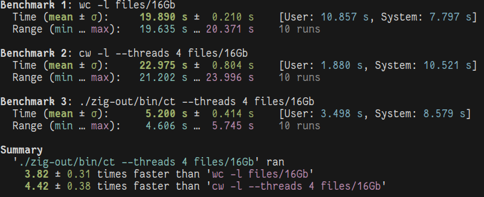
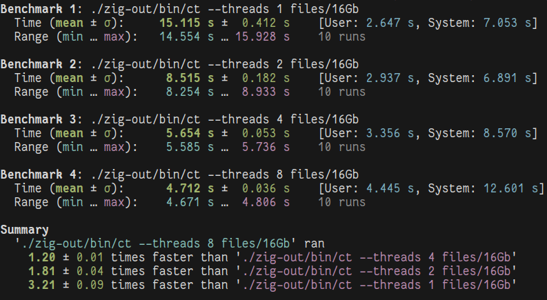

# CounT

⚡ The fastest line counter on my computer ⚡


## Usage


See the usage with `ct --help`.
```
usage: ct [OPTIONS] [input]...
OPTIONS
	--threads,-t <threads>          Sets the number of threads to use. (default: 1)
	--chunks-size,-c <chunks-size>  Sets the size (in bytes) of the chunks allocated. (default: 2048Kb)
	--help,-h                       Prints the help message.
ARGS
	<input>		Path to the input file(s).
```

## The Algorithm

`ct` uses a multithreaded algorithm that reads the input file in chunks.
It allocates a fixed amount of memory for each thread (that can be set with `--chunks-size`), and reuses it for the whole execution of the program.
This minimizes the number of allocations and makes the execution quite fast.
Setting the `--chunk-size` parameter properly can have a huge impact on the performance.

## Benchmarks

There is a script file to generate test data for comparison.
Run `./scripts/gen.zig` to generate files of different sizes, up to 16Gb.
The files are saved in the directory `./files`.
Generating the files might take a while.
They are generated by a blazingly fast Zig script.
You can reproduce the benchmarks by running `make benchmark`.
You need `hyperfine` and `cw` installed.
To see how the results are obtained check `./scripts/benchmark.sh`.

### Single Thread Benchmarks

I compared `ct` to `wc -l`, [`cw -l`](https://github.com/Freaky/cw) and a trivial Python script.
The Python script (`./scripts/countlines.py`) fails on the 16Gb file, so that I do not include it in what follows.


### Multithreaded Benchmarks

`ct`'s algorithm is optimized for multithreading.
`wc -l` is not multithreaded, so that we have to compare to sequential code.
Here are the results using 4 threads in `ct` and `cw`:



The results are unfair, because `cw` does not allow multithreaded execution on a single file (at least in version `0.7.0`), as it puts each different input file on a different thread.
This implies that for a single file, `ct` is by far the fastest line counter out there!
To perform a fair comparison with `cw`, we have to use as many files as threads, so that the tool can parallelize optimally its computations.
Here, I use 4 threads.


Observe that this case is particularly advantageous for `cw` because the tasks are perfectly balanced.
By giving as input files of different sizes `cw` does not scale lineraly.
`ct` scales better in this case because it divides the overall work fairly over the threads.

### Scalability
`ct` scales reasonably well:



### My Machine

* Ubuntu 20.04.6 LTS
* Intel® Core™ i7-8650U CPU @ 1.90GHz × 8
* 16Gb Memory
* 512Gb SSD

## Building

Zig should be version `>= 0.12.0`.
To build simply run `make`.
If you want to build the optimized version use `make release`.
